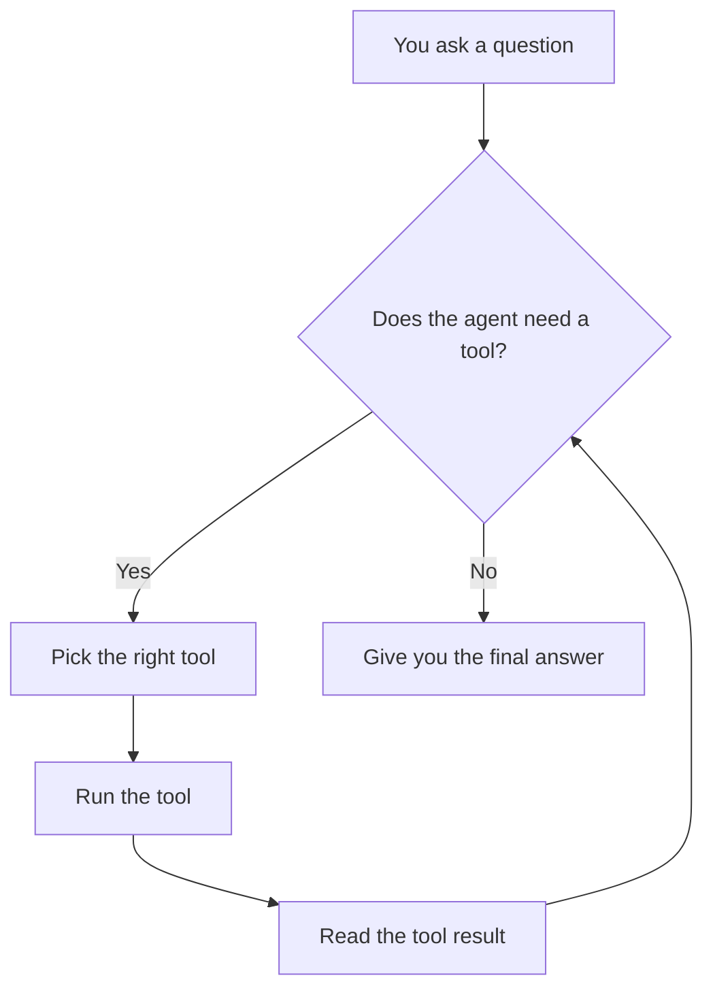
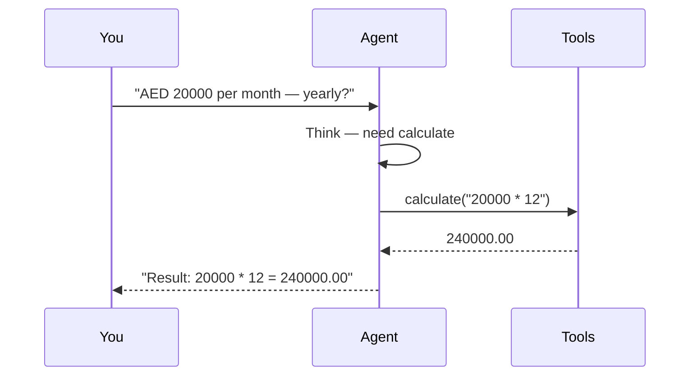

# AI Automation Agent

**Author:** Hammad Durrani (HDxpert)  
**Live demo:** https://hammad-ml-dev.github.io/Ai-automation-agent/

---

## About this tool

This tool is a **personal automation helper** that can finish small tasks for you without you picking the steps yourself.

You type a request in plain language — for example *“how much is AED 20,000 per month per year?”* or *“save a note to apply to five jobs.”* The agent decides whether it needs a **tool** (calculator, date, note saver, or search), runs that tool, reads the result, and then gives you a clear final answer.

**Who it’s for**
- Learners who want to *see* how AI agents actually work  
- Recruiters who want a clickable demo of tool-using AI  
- Anyone who wants a tiny, understandable automation loop — not a black box  

**What it can do today**

| Capability | Example ask |
|------------|-------------|
| Check today’s date | “What is today’s date?” |
| Do math safely | “If I earn AED 20000/month, how much per year?” |
| Save a reminder | “Save a note: Apply to 5 Dubai jobs today” |
| Look up info (mock search) | “Search for python jobs in Dubai” |

Demo mode works **without an API key**. With a free Groq key, the same loop uses a live LLM.

---

## How it works (simple flow)



### Step-by-step inside one request



---

## Tools available

| Tool | What it does for you |
|------|----------------------|
| `get_current_date` | Tells you today’s date |
| `calculate` | Solves basic math |
| `save_note` | Writes a note to a file (or browser storage in the demo) |
| `search_web` | Returns mock search results (no search API needed) |

---

## Try it

1. **Live demo (browser):** https://hammad-ml-dev.github.io/Ai-automation-agent/  
2. **On your PC:**

```bash
git clone https://github.com/hammad-ml-dev/Ai-automation-agent.git
cd Ai-automation-agent
python -m venv .venv
.\.venv\Scripts\Activate.ps1
pip install -r requirements.txt
copy .env.example .env
python agent.py
```

Flask UI with a visible step trace:

```bash
set PYTHONPATH=src
python web/app.py
```

Open http://127.0.0.1:5055

---

## Project layout

```
src/agent/   tools, loop, offline demo brain
web/app.py   local UI showing each step
docs/        GitHub Pages demo
agent.py     one-command CLI
```

---

## Learning path

1. Click the sample chips on the live demo  
2. Read `src/agent/tools.py` then `src/agent/loop.py`  
3. Add one new tool and teach the agent when to use it  

---

## Built with

Python · optional Groq LLM · Flask (local UI)

---

Shared for learning and portfolio demonstration. Please credit **Hammad Durrani**.
